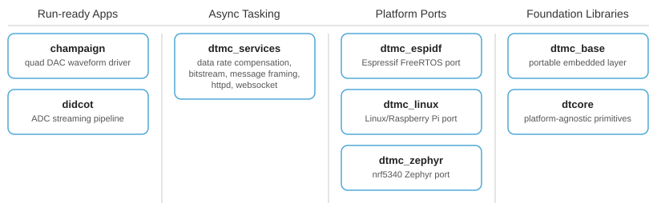

# Embedded Applications Lab

A set of working applications based on a set of reusable libraries across MCU, Linux, and RTOS targets.

## Applications

Complete, runnable applications that exercise the stack on real hardware. 

| Application | Description |
|---|---|
| [`champaign`](https://github.com/david-erb/champaign) | drives an MCP4728 quad-DAC over I2C, generating four simultaneous 12-bit analog waveforms across the 0–3.3 V range at a 100 Hz update rate.  |
| [`didcot`](https://github.com/david-erb/didcot) | samples four analog channels continuously on an nRF5340, frames the data into a buffer queue, and streams it over USB CDC-ACM to a Linux server; the server distributes frames over a local WebSocket connection to a browser trend display. |

## Libraries

| Repo | Role |
|---|---|
| [`dtcore`](https://github.com/david-erb/dtcore) | Foundation — platform-agnostic primitives and utilities |
| [`dtmc_base`](https://github.com/david-erb/dtmc_base) | Portable embedded layer — drivers and HAL abstractions |
| [`dtmc_services`](https://github.com/david-erb/dtmc_services) | Higher-level services built on `dtmc_base` |
| [`dtmc_espidf`](https://github.com/david-erb/dtmc_espidf) | Platform backend for ESP-IDF (Espressif) |
| [`dtmc_linux`](https://github.com/david-erb/dtmc_linux) | Platform backend for Linux |
| [`dtmc_zephyr`](https://github.com/david-erb/dtmc_zephyr) | Platform backend for Zephyr RTOS |
